# How OpenBotX Works

This document explains the complete execution flow of the OpenBotX AI agent, from the moment a user sends a message to the final response delivery. Each step follows the actual execution sequence of the system.

---

## Table of Contents

1. [Overview](#1-overview)
2. [Server Startup](#2-server-startup)
3. [Configuration Loading](#3-configuration-loading)
4. [Authentication](#4-authentication)
5. [Message Entry](#5-message-entry)
6. [Message Bus](#6-message-bus)
7. [Message Processing](#7-message-processing)
8. [Context Building](#8-context-building)
9. [The .md Files](#9-the-md-files)
10. [Skills](#10-skills)
11. [Creating New Skills](#11-creating-new-skills)
12. [Agent Loop](#12-agent-loop)
13. [AI Provider Selection](#13-ai-provider-selection)
14. [Tools](#14-tools)
15. [Subagents](#15-subagents)
16. [Memory and Consolidation](#16-memory-and-consolidation)
17. [Sessions](#17-sessions)
18. [Task Management](#18-task-management)
19. [Heartbeat and WebSocket](#19-heartbeat-and-websocket)
20. [Scheduler (Cron)](#20-scheduler-cron)
21. [Output Routing](#21-output-routing)
22. [Server Shutdown](#22-server-shutdown)
23. [Complete Cycle](#23-complete-cycle)

---

## 1. Overview

OpenBotX is an AI assistant platform that runs as a web server. When you start the system with `openbotx start`, a FastAPI server boots up and creates all the necessary components.

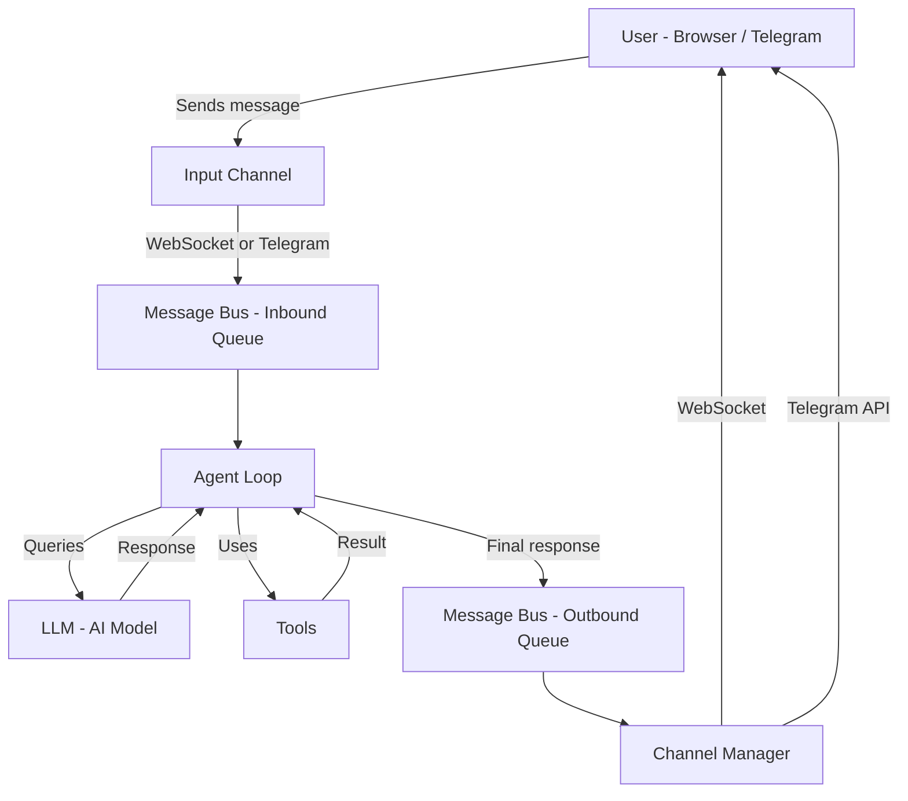

Everything is wired together in `openbotx/server/app.py`, inside the `lifespan()` function, which runs when the server starts.

---

## 2. Server Startup

When you run `openbotx start`, the CLI (`openbotx/cli/commands.py`) does the following:

1. Starts a Uvicorn (ASGI) server with the configured host and port (default: `0.0.0.0:8000`)
2. After 1.5 seconds, automatically opens the browser (unless `--no-browser` is passed):
   - If `server.public_url` is configured (e.g., `https://my-domain.com`), opens that URL
   - Otherwise, opens `http://localhost:{port}/app/`

The FastAPI server uses an async **lifespan** that manages the entire lifecycle. During startup, components are created in this order:

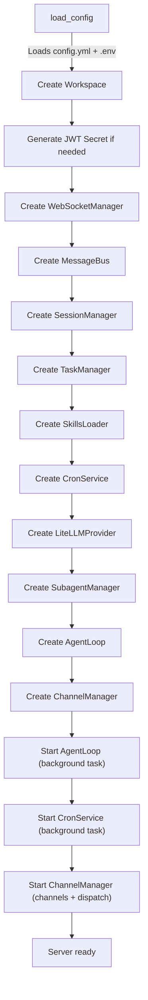

Each component receives references to previously created ones. For example, the `AgentLoop` receives the `bus`, `provider`, `task_manager`, `session_manager`, `skills_loader`, `subagent_manager`, and `cron_service`.

---

## 3. Configuration Loading

The `load_config()` in `openbotx/config/loader.py` does the following:

1. **Loads `.env`**: Calls `load_dotenv()` to load environment variables from the `.env` file at the project root
2. **Reads `config.yml`**: Parses the YAML file with `yaml.safe_load()`
3. **Expands environment variables**: Substitutes `${VAR}` patterns with actual environment variable values, recursively across strings, dicts, and lists:

```yaml
# config.yml
providers:
  anthropic:
    api_key: ${ANTHROPIC_API_KEY}  # will be replaced with the actual value
```

4. **Validates with Pydantic**: The resulting dictionary is validated by the `Config` model (Pydantic), which applies defaults for missing fields

### Important Defaults

| Setting | Default |
|---|---|
| Server | `host: 0.0.0.0`, `port: 8000`, `public_url: ""` |
| Authentication | `username: admin`, `password: admin` |
| Model | `anthropic/claude-sonnet-4-20250514` |
| Model params | `max_tokens: 8192`, `temperature: 0.1` |
| Max iterations | `max_iterations: 40` |
| Memory window | `memory_window: 100` |
| Shell timeout | `exec.timeout: 60` seconds |
| Workspace restriction | `restrict_to_workspace: true` |
| WebSocket progress | `send_progress: true` |
| Tool hints | `send_tool_hints: false` |

### Saving

`save_config()` uses `model_dump(exclude_defaults=True)` — meaning it only saves values that differ from defaults, keeping `config.yml` clean and minimal.

---

## 4. Authentication

The authentication system (`openbotx/server/auth.py`) uses **JWT (JSON Web Tokens)** to protect API routes.

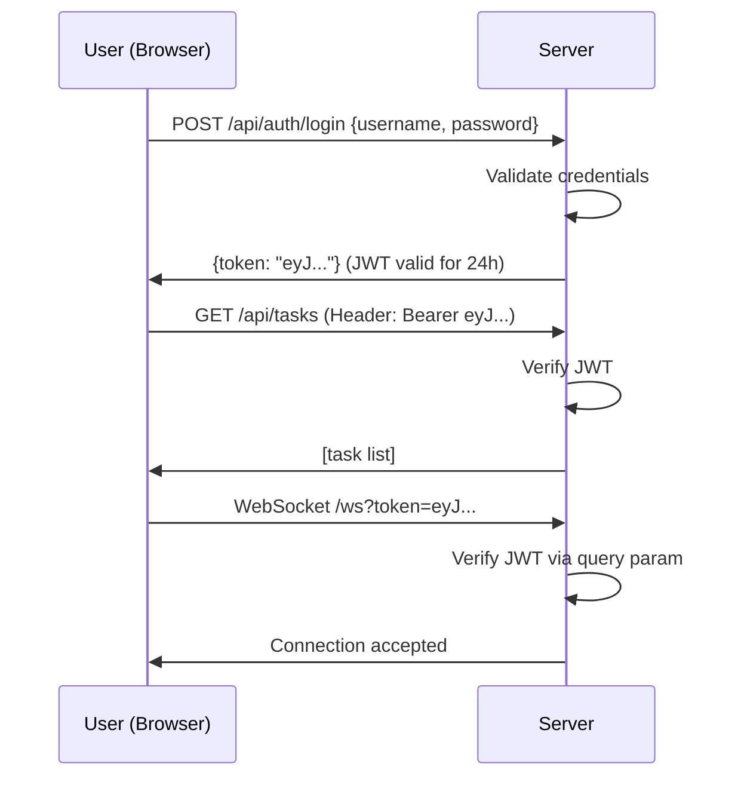

### Flow Details

1. **Login**: The user sends `POST /api/auth/login` with username and password. If valid, receives a JWT token signed with HS256, valid for **24 hours**
2. **API routes**: All routes under `/api/` require the `Authorization: Bearer {token}` header. The middleware extracts and validates the token
3. **WebSocket**: The token is passed as a query parameter (`/ws?token=...`) and validated before accepting the connection. If invalid, the connection is closed with code `4001`
4. **Public routes**: The following routes do not require authentication:
   - `/api/auth/login` and `/api/health` (public routes)
   - `/app/*` (static frontend)
   - `/ws` (authentication handled internally)

If no `secret_key` is configured in `config.yml`, the server automatically generates a random UUID as the secret on startup.

---

## 5. Message Entry

A message can enter the system through three paths:

### Via WebSocket (Browser)

1. The user opens the browser at `http://localhost:8000`
2. The Vue.js frontend connects via **WebSocket** at `/ws?token={jwt}`
3. When the user sends a message, the frontend sends a JSON event:

```json
{
  "type": "chat:send",
  "data": {
    "message": "Hello, how are you?",
    "session_id": "direct",
    "metadata": {}
  }
}
```

4. The `websocket_endpoint()` (`openbotx/server/websocket.py`) creates an `InboundMessage` and publishes it to the bus inbound queue:

```python
msg = InboundMessage(
    channel="web",
    sender_id="web_user",
    chat_id=session_id,
    content=content,
    metadata=data.get("data", {}).get("metadata", {}),
)
await bus.publish_inbound(msg)
```

### Via REST API

In addition to WebSocket, there is a REST route for sending messages:

```
POST /api/chat
{
  "message": "Hello",
  "session_id": "direct"
}
```

The route (`openbotx/server/routes/chat.py`) creates a task beforehand and injects the `task_id` into the message metadata. Returns `{"task_id": "abc123", "session_id": "direct"}` — the frontend can then track progress via WebSocket.

### Via Telegram

1. The `TelegramChannel` performs periodic **polling** on the Telegram API to fetch new messages
2. Upon receiving a message, it creates an `InboundMessage` with `channel="telegram"` and Telegram metadata (`user_id`, `username`, `first_name`, `is_group`, `message_id`)
3. If the message contains media (photos, documents), the file is downloaded to the `public/media/` directory inside the project folder and a **relative path** (e.g., `public/media/abc123.jpg`) is added to the `media` list
4. The message is published to the same bus inbound queue

### InboundMessage Structure

In all cases, the message becomes an `InboundMessage` with these fields:

| Field | Description |
|---|---|
| `channel` | Source: `"web"` or `"telegram"` |
| `sender_id` | Who sent it (e.g., `"web_user"`, `"telegram_12345"`) |
| `chat_id` | Conversation identifier |
| `content` | Message text |
| `media` | List of attached file paths |
| `metadata` | Extra data (task_id, message_id, etc.) |
| `session_key` | Session key: `channel:chat_id` (e.g., `web:direct`) |
| `session_key_override` | If set, overrides the session key |

---

## 6. Message Bus

The Message Bus (`openbotx/bus/queue.py`) is the heart of the communication system. It works as an internal mailbox with two queues:

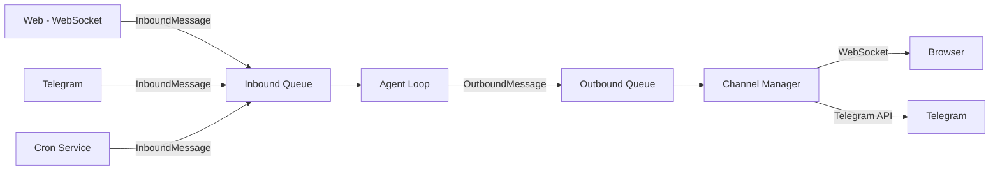

```python
class MessageBus:
    def __init__(self):
        self.inbound: asyncio.Queue[InboundMessage] = asyncio.Queue()
        self.outbound: asyncio.Queue[OutboundMessage] = asyncio.Queue()
```

The bus uses Python async queues (`asyncio.Queue`). This means the producer doesn't need to wait for the consumer — they are independent processes.

The bus **decouples** channels from the agent. Telegram knows nothing about the AgentLoop, and the AgentLoop knows nothing about Telegram. They only know the bus.

---

## 7. Message Processing

The `AgentLoop` (`openbotx/agent/loop.py`) runs in the background, waiting for messages in the inbound queue:

```python
async def run(self):
    while not self._stop_event.is_set():
        msg = await self._bus.consume_inbound()  # wait for a message
        await self._process_message(msg)          # process it
```

When a message arrives, `_process_message()` does the following in sequence:

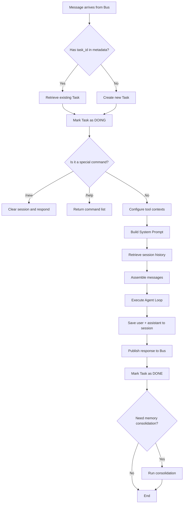

### 7.1. Task Creation/Recovery

Each user message becomes a **task**. If the message already has a `task_id` in its metadata (as with the REST API), it retrieves the existing task. Otherwise, it creates a new task with the title being the first 50 characters of the message. The task starts in the **DOING** state.

### 7.2. Special Commands

Before sending to the LLM, the agent checks if the message is a command:

- **`/new`** — Clears the session history and responds "Conversation cleared. How can I help you?"
- **`/help`** — Returns the list of available commands

If it's a command, the task is marked as **DONE** and the response is sent directly via the bus, without going through the LLM.

### 7.3. Tool Contexts

Before calling the LLM, the agent configures three tools with the current message context:

- **message tool**: receives `channel` and `chat_id` to know where to send intermediate messages. Also calls `start_turn()` which resets the `_sent_in_turn` flag — this tracks whether the tool has already sent a message in this turn
- **spawn tool**: receives `channel`, `chat_id`, and `parent_task_id` (to link subagents to the parent task)
- **cron tool**: receives `channel` and `chat_id` (so scheduled jobs know where they originated)

### 7.4. Error Handling

If the Agent Loop throws an exception, the error is caught and:
1. The task is marked as **ERROR** with the error message
2. An error response is sent to the user: `"I encountered an error: {error}"`

---

## 8. Context Building

The `ContextBuilder` (`openbotx/agent/context.py`) is responsible for assembling the "system prompt" — the text that tells the LLM who it is and what it knows. The prompt is built in this order:

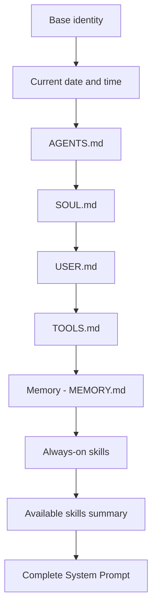

### 8.1. Base Identity

```
"You are OpenBotX, a personal AI assistant."
```

### 8.2. Current Date and Time

```
"Current date and time: 2025-01-15 14:30:00."
```

### 8.3. Bootstrap Files (.md)

The system reads 4 files from the workspace root, in this fixed order:
1. `AGENTS.md`
2. `SOUL.md`
3. `USER.md`
4. `TOOLS.md`

Each is added as a section in the prompt (details in step 9).

### 8.4. Memory

If a `memory/MEMORY.md` file exists in the workspace, its content is added as a "Memory" section in the prompt.

### 8.5. Always-on Skills

Skills marked with `always: true` are automatically loaded and added to the prompt as individual sections.

### 8.6. Available Skills Summary

An XML list of all available skills is added, so the LLM knows what it can request:

```xml
<skills>
  <skill name="code-review" status="available">Review code for issues</skill>
  <skill name="git" status="available" always="true">Git operations</skill>
</skills>
```

### 8.7. Final Message Assembly

After building the system prompt, `build_messages()` assembles the message list:

```python
[
    {"role": "system", "content": system_prompt},
    # ... session history (up to 500 messages) ...
    {"role": "user", "content": "current user message"}
]
```

If the message contains media (images), the agent loop resolves relative paths to base64 data URIs via the storage provider (see section 22). The user content is then assembled as multimodal:

```python
{"role": "user", "content": [
    {"type": "text", "text": "describe this image"},
    {"type": "image", "url": "data:image/jpeg;base64,/9j/4AAQ..."}
]}
```

Before sending to the LLM API, the provider converts this to the OpenAI-compatible format:

```python
{"type": "image_url", "image_url": {"url": "data:image/jpeg;base64,/9j/4AAQ..."}}
```

Using data URIs instead of HTTP URLs ensures compatibility with all cloud LLM providers, which cannot access `localhost` URLs.

---

## 9. The .md Files

These files reside at the workspace root and define the agent's personality and behavior:

### SOUL.md — The Agent's "Soul"

Defines personality, tone of voice, and general behavior rules. Example:

```markdown
You are a helpful AI assistant.
- Always be polite and professional
- Respond in the same language as the user
- When unsure, ask for clarification
```

### USER.md — User Information

Contains information about the user that helps the agent personalize responses:

```markdown
- Name: Paulo
- Preferred language: Portuguese
- Timezone: America/Sao_Paulo
```

### AGENTS.md — Agent Descriptions

Describes the available agents and their capabilities:

```markdown
## Main Agent
General-purpose assistant capable of file operations, web search, and code execution.
```

### TOOLS.md — Tools Documentation

Provides additional instructions on how to use tools:

```markdown
## File Operations
When reading files, always check if the file exists first.
```

All these files are **optional**. If they don't exist, the agent works with the base identity. They are read **every time** a message is processed, so you can edit them at any moment and the effect is immediate.

---

## 10. Skills

Skills are extra capabilities you can give to the agent. Each skill is a Markdown file with specific instructions.

### How They Are Organized

Skills reside in two directories:
- **Built-in**: `openbotx/skills/` (shipped with the system)
- **Workspace**: `workspace/skills/` (created by the user)

Each skill is a folder with a `SKILL.md` file inside:

```
skills/
  code-review/
    SKILL.md
  git/
    SKILL.md
  summarize/
    SKILL.md
```

### SKILL.md Format

Each file has a **YAML frontmatter** at the top (between `---`) and the content below:

```markdown
---
name: code-review
description: Reviews code for bugs and improvements
always: false
requires:
  bins: []
  env: []
---

When asked to review code, analyze it for:
1. Bugs and logic errors
2. Security vulnerabilities
3. Performance issues
```

### Frontmatter Fields

| Field | Description |
|---|---|
| `name` | Skill name (used as identifier) |
| `description` | Short description (appears in the skills summary) |
| `always` | If `true`, the content is automatically included in every message's prompt |
| `requires.bins` | Programs that must be installed (e.g., `git`, `npm`). Checked via `shutil.which()` |
| `requires.env` | Environment variables that must exist (e.g., `BRAVE_API_KEY`). Checked via `os.environ.get()` |

The `bins` and `env` fields accept both a single string and a list.

### How They Are Loaded

The `SkillsLoader` (`openbotx/agent/skills.py`) does the following:

1. Scans skill directories (**built-in first**, then workspace)
2. Workspace skills with the same name **override** built-in ones
3. For each skill, reads the `SKILL.md` and parses the frontmatter using a regex `^---\n...\n---\n`
4. Checks if dependencies are satisfied (binaries installed, env vars present)
5. Skills with `always: true` are included in the prompt automatically
6. Skills with `always: false` appear in the available skills list for the LLM to use when needed
7. Skills with unsatisfied dependencies appear as `status="unavailable"` and are not used

---

## 11. Creating New Skills

To create a new skill, follow these steps:

### Step 1: Create the Folder

```bash
mkdir -p workspace/skills/my-skill
```

### Step 2: Create the SKILL.md

```markdown
---
name: my-skill
description: Does something very useful
always: false
requires:
  bins: []
  env: []
---

Instructions for the agent on how to use this skill.

When the user asks to use "my-skill", do the following:
1. First step
2. Second step
3. Third step
```

### Step 3: Use It

The skill automatically appears in the available skills list. The agent can use it when the user asks for something related to its description.

### Always-on Skills

If you want the skill to always be active (without needing to be requested), set `always: true`:

```yaml
---
name: project-rules
description: Rules the agent must always follow
always: true
---

Rules:
- Always respond in Portuguese
- Never delete files without confirming
```

### Skills with Dependencies

If the skill requires an installed program or environment variable:

```yaml
---
name: docker-helper
description: Helps with Docker
requires:
  bins: [docker, docker-compose]
  env: [DOCKER_HOST]
---
```

If dependencies are not satisfied, the skill appears as "unavailable" and is not used.

---

## 12. Agent Loop

The Agent Loop (`_run_agent_loop()` in `openbotx/agent/loop.py`) is the heart of the processing. It implements the **ReAct** pattern (Reason + Act) — the LLM thinks, acts (uses tools), observes the result, and repeats.

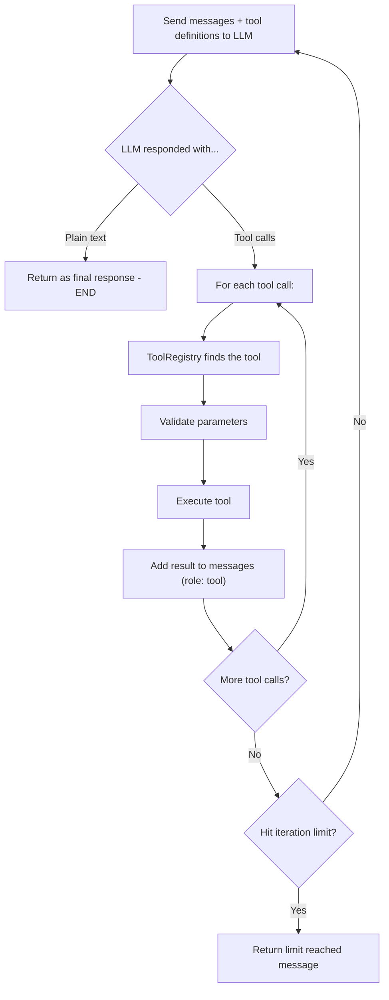

### Real-time Broadcasting

During the loop, the agent sends events via WebSocket so the frontend can show progress:

- **`chat:tool_use`** — when a tool is executed. Sent with the tool name in human-readable format (e.g., `Read File`, `Web Search`)
- **`chat:thinking`** — when the LLM returns reasoning content (see below)

### Extended Thinking (Reasoning)

Some LLM models support **extended thinking** — a feature where the model exposes its internal chain-of-thought alongside the final response. This is a model-specific capability, not something OpenBotX controls.

**Which models support it:**
- Anthropic Claude models with extended thinking enabled (e.g., `claude-sonnet-4-20250514` with thinking mode)
- Other providers may add support via LiteLLM as they release thinking-capable models

**How it flows through the system:**

1. The agent loop sends a request to the LLM via `provider.chat()`
2. LiteLLM returns the response with an optional `reasoning_content` field on the message object
3. `LiteLLMProvider` extracts it: `getattr(message, "reasoning_content", None)` and includes it in the `LLMResponse` dataclass
4. The agent loop checks if `reasoning_content` exists. If it does, it broadcasts a `chat:thinking` WebSocket event:

```python
if response.reasoning_content and self._ws_manager:
    await self._ws_manager.broadcast("chat:thinking", {
        "task_id": task_id,
        "content": response.reasoning_content,
    })
```

5. The frontend receives this event and can display the model's thought process (e.g., in a collapsible "thinking" section above the response)

**What happens with the reasoning content after broadcast:**
- It is saved into the conversation messages via `ContextBuilder.add_assistant_message()` (as the `reasoning_content` field)
- However, it is **stripped before sending to the LLM** on subsequent turns — `_sanitize_messages()` only keeps `role`, `content`, `tool_calls`, `tool_call_id`, and `name`. The reasoning is not re-sent to the model
- This means reasoning is broadcast once for real-time display, stored in the session for history, but never re-injected into future LLM calls

For models that don't support extended thinking, `reasoning_content` is simply `None` and no `chat:thinking` event is broadcast. The agent loop works identically in both cases.

### Iteration Limit

The loop has a maximum iteration limit (default: **40**, configurable via `params.max_iterations`). If the agent hits this limit without reaching a final response, it returns:

```
"I've reached my processing limit. Please try again or simplify your request."
```

### Result Truncation

Tool results are truncated to **500 characters** before being added back to the LLM messages. This prevents excessively large results from consuming tokens unnecessarily.

### Practical Example

Imagine the user asks "List the files in the docs/ folder":

**Iteration 1:**
- LLM receives the message and decides to call the `list_dir` tool with `{"path": "docs/"}`
- The tool returns: `"architecture.md\nconfiguration.md\napi.md\nskills.md\ntools.md"`
- Result is added to messages

**Iteration 2:**
- LLM receives the result and generates text: "The files in the docs/ folder are: architecture.md, configuration.md, ..."
- Since it's plain text (no tool calls), the loop ends
- This is the final response sent to the user

---

## 13. AI Provider Selection

OpenBotX supports multiple AI providers via **LiteLLM**. The selection of which provider to use follows a cascade logic in `Config.get_provider()` (`openbotx/config/schema.py`):

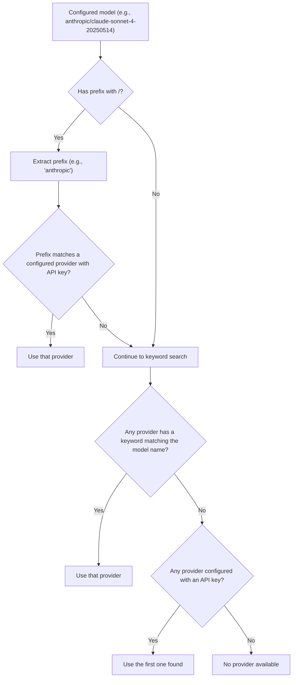

### Model Name Resolution

The `LiteLLMProvider` (`openbotx/providers/litellm_provider.py`) transforms the model name before sending to LiteLLM:

1. If there's a configured **gateway** (explicit provider), it applies the gateway prefix and optionally strips the original prefix
2. Otherwise, it looks up the provider specification by model name and adds the correct LiteLLM prefix

### Prompt Caching

Cloud LLM providers like Anthropic charge tokens to process the system prompt and tool definitions on every API call. Since these rarely change between turns (the system prompt, .md files, memory, and tool schemas are the same throughout a conversation), re-processing them on every call wastes time and money.

**Prompt caching** tells the provider to keep these blocks in a temporary server-side cache. On subsequent calls within the same session, the provider recognizes the cached content and skips re-processing, reducing both latency and cost.

Currently, two providers support this: **Anthropic** and **OpenRouter**. The flag `supports_prompt_caching` is set per provider in `openbotx/providers/registry.py`.

When enabled, `_apply_cache_control()` in `openbotx/providers/litellm_provider.py` transforms the messages before sending to the API:

**System message** — the content is converted from a string to a list of content blocks, with `cache_control` on the last block:

```python
# Before:
{"role": "system", "content": "You are OpenBotX..."}

# After:
{"role": "system", "content": [
    {"type": "text", "text": "You are OpenBotX...", "cache_control": {"type": "ephemeral"}}
]}
```

**Tool definitions** — `cache_control` is added to the last tool in the list:

```python
# Before:
[{"type": "function", "function": {"name": "read_file", ...}}, ...]

# After (last tool only):
[..., {"type": "function", "function": {"name": "image_generation", ...}, "cache_control": {"type": "ephemeral"}}]
```

The `ephemeral` type means the cache is temporary — the provider decides how long to keep it (typically 5 minutes of inactivity for Anthropic). Non-system messages (user, assistant, tool results) are **not** cached because they change every turn.

This transformation is applied automatically and transparently — the rest of the codebase works with regular strings and lists, unaware of caching.

### LLM Error Recovery

- **Malformed JSON**: When the LLM returns tool call arguments with invalid JSON, the system uses `json_repair.loads()` to attempt automatic correction
- **Empty content**: Messages with empty content are replaced with `"(empty)"` to avoid provider 400 errors
- **Sanitization**: Only allowed keys (`role`, `content`, `tool_calls`, `tool_call_id`, `name`) are sent to the LLM — extra fields are stripped

---

## 14. Tools

Tools are capabilities that the agent can use to interact with the world. Each tool is a Python class that inherits from `Tool` (`openbotx/tools/base.py`) and implements the `execute()` method.

### Tool Registry

The `ToolRegistry` (`openbotx/tools/registry.py`) manages all tools:

```python
class ToolRegistry:
    def register(self, tool: Tool)           # register a tool
    def get_definitions(self) -> list[dict]  # return schemas for the LLM
    async def execute(name, params) -> str   # execute a tool
```

When the AgentLoop calls the LLM, it sends tool definitions (name, description, parameters) so the LLM knows what's available.

### Available Tools

| Tool | Description |
|---|---|
| `read_file` | Read file contents |
| `write_file` | Write content to a file |
| `edit_file` | Edit parts of an existing file |
| `list_dir` | List files and folders in a directory |
| `exec` | Execute shell commands |
| `web_search` | Search the web (Brave Search API) |
| `web_fetch` | Fetch content from a URL |
| `message` | Send intermediate messages to the user |
| `spawn` | Create subagents for parallel tasks |
| `cron` | Schedule recurring or one-time tasks |
| `save_memory` | Save information to long-term memory |
| `browser` | Browser automation (Chrome/Chromium via CDP) |
| `http_client` | Make HTTP requests (GET, POST, etc.) |
| `image_generation` | Generate images (if configured) |

### Parameter Validation

Before executing any tool, the `ToolRegistry` validates parameters using the JSON schema defined by the tool. Validation includes:
- Required field checking (`required`)
- Type validation (`string`, `integer`, `boolean`, `array`, `object`)
- Enum verification (allowed values)
- Minimum and maximum limits

### Tool Error Handling

When a tool fails, the result includes the error message followed by a hint for the LLM:

```
Error: File not found: config.yml

[Analyze the error above and try a different approach.]
```

This hint is automatically appended by the `ToolRegistry` to any result starting with "Error" or when an exception occurs. This instructs the LLM to try a different approach instead of repeating the same error.

If the tool is not found, the error message lists all available tools, helping the LLM self-correct.

### Workspace Restriction

By default, file tools (`read_file`, `write_file`, `edit_file`, `list_dir`) and the shell (`exec`) are restricted to the workspace directory. The restriction works as follows:

- **File tools**: Relative paths are resolved from the workspace. Absolute paths are verified with `relative_to()` — if they fall outside the allowed directory, a `PermissionError` is raised
- **Shell (exec)**: Applies additional safety guards (see below)

### Shell Safety Guards (exec)

The `exec` tool (`openbotx/tools/shell.py`) has multiple layers of protection:

**Blocked commands** — Regex patterns that prevent execution:
- `rm -rf`, `del /f`, `rmdir /s` (destructive deletion)
- `format`, `mkfs`, `diskpart` (disk formatting)
- `dd if=`, `> /dev/sd` (direct device writing)
- `shutdown`, `reboot`, `poweroff` (machine shutdown)
- Fork bombs (`:(){ ... };:`)

**Path traversal protection** — Blocks commands containing `../` or `..\`

**Absolute path restriction** — When `restrict_to_workspace=True`, absolute paths in the command are verified to ensure they are within the working directory

**Timeout** — Commands exceeding the timeout (default: 60s) are automatically killed with `process.kill()`

**Truncation** — Output larger than **10,000 characters** is truncated with a warning

### Browser (CDP Automation)

The `browser` tool controls Google Chrome in headless mode via **Chrome DevTools Protocol (CDP)**. It uses a multi-tab architecture that allows the main agent and subagents to use the browser concurrently, each in its own isolated tab.

**Architecture:**

```
┌─────────────────────────────────────────────┐
│          _ChromeInstance (singleton)         │
│   One Chrome process, shared across all      │
│   BrowserTool instances                      │
│                                              │
│   ┌──────────┐ ┌──────────┐ ┌──────────┐   │
│   │  Tab #1  │ │  Tab #2  │ │  Tab #3  │   │
│   │  (main)  │ │ (sub #1) │ │ (sub #2) │   │
│   └──────────┘ └──────────┘ └──────────┘   │
└─────────────────────────────────────────────┘
```

- **Profile**: Uses `~/.openbotx/chrome-profile` as the profile directory (shared across all projects so the user doesn't need to reconfigure Chrome for each one)
- **Singleton Chrome process**: `_ChromeInstance` manages a single Chrome process. It starts lazily on the first `open_tab()` call and is shared by all `BrowserTool` instances
- **Per-instance tabs**: Each `BrowserTool` instance gets its own CDP target (tab) via `open_tab()`. The main agent and each subagent operate on independent tabs without interfering with each other
- **Available actions**: `navigate`, `snapshot` (page text, max 50,000 characters), `screenshot`, `click`, `type`, `evaluate` (JavaScript), `wait`
- **Auto-detection**: Searches for Chrome in standard locations on macOS, Linux, and Windows
- **Tab cleanup**: `close_tab()` closes a single tab. Subagents always call this in a `finally` block, ensuring tabs are released even when errors occur (see section 15)
- **Process cleanup**: On server shutdown, `cleanup()` closes the CDP connection and terminates the Chrome process entirely

---

## 15. Subagents

Subagents are independent agents that run in parallel to execute specific tasks. They are created by the main agent using the `spawn` tool.

### Fire-and-Forget Model

Spawning a subagent is **asynchronous** — the main agent does not wait for the result. The full lifecycle works as follows:

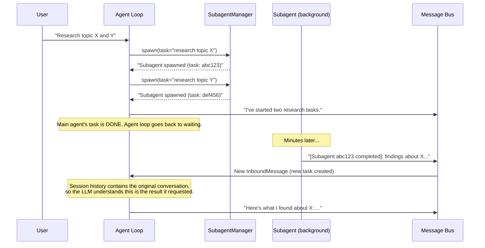

Step by step:

1. The LLM calls `spawn(task="...")` during its agent loop iteration
2. `SubagentManager.spawn()` creates an `asyncio.Task` in the background and returns **immediately** with `"Subagent spawned (task: abc123): ..."`
3. That string goes back to the LLM as a tool result. The LLM can spawn more subagents, use other tools, or finish its response
4. The main agent's task completes (DONE). The agent loop goes back to `bus.consume_inbound()`, waiting for the next message

When the subagent finishes (seconds or minutes later):

5. It publishes an `InboundMessage` to the bus: `"[Subagent abc123 completed]: result..."`
6. The agent loop picks this up as a **completely new message** and creates a new task for it
7. The system prompt and **full session history** are rebuilt — this includes the earlier conversation where the user asked the question and the agent decided to spawn
8. The LLM reads the history, sees its own spawn decision, and connects the subagent result to the original request. It then formulates a response using the result

The agent "remembers" because of the **session history** — not because of any explicit callback or state machine. The LLM reads the conversation flow and infers the relationship between the spawn and its completion.

### Subagent Restrictions

Subagents have **limited access** to tools:

| Allowed | Blocked |
|---|---|
| `read_file`, `write_file`, `edit_file`, `list_dir` | `message` (send messages to user) |
| `exec` (shell) | `spawn` (create other subagents) |
| `web_search`, `web_fetch` | `cron` (schedule tasks) |
| `http_client`, `browser`, `image_generation` | `save_memory` |

This prevents subagents from multiplying uncontrollably, sending unexpected messages, or modifying memory.

**Browser tab isolation** — Each subagent creates its own browser tab via `BrowserTool`. The tab is always closed in a `finally` block when the subagent finishes (whether it succeeds, fails, or throws an exception). This guarantees tabs are never leaked, even under error conditions. See section 14 for the multi-tab architecture.

### Differences from Main Agent

| Feature | Main Agent | Subagent |
|---|---|---|
| Max iterations | 40 | **15** |
| System prompt | Full (SOUL + USER + memory + skills) | **Simplified** ("You are a subagent...") |
| Session history | Yes | **No** |
| Memory | Yes | **No** |
| Tools | All (13+) | **10** (no message, spawn, cron, save_memory) |
| Model | Configurable per agent | **Inherits from main agent** |

### Completion

When the subagent completes its task:
1. The task is marked as **DONE** with the result (first 500 characters)
2. An `InboundMessage` is published to the bus with the format `[Subagent {task_id} completed]: {result}` (first 300 characters)
3. This message returns to the main agent, which can use the result to continue its work

If the subagent fails, the task is marked as **ERROR** with the error message.

### Background Task Tracking

The `SubagentManager` maintains a `set[asyncio.Task]` with all background tasks. When one finishes, it is automatically removed from the set via `add_done_callback`.

---

## 16. Memory and Consolidation

The memory system allows the agent to remember important information across conversations.

### Structure

Memory resides in the `memory/` folder of the workspace:

```
workspace/
  memory/
    MEMORY.md     # Long-term memory (facts, preferences)
    HISTORY.md    # Consolidated history (conversation summaries)
```

### How Memory Is Used

Memory is loaded **on every message**, not once at startup. The `ContextBuilder.build_system_prompt()` calls `memory.get_memory_context()` each time it assembles the system prompt. This method reads `memory/MEMORY.md` from disk, so any changes to the file (whether from consolidation, the `save_memory` tool, or manual editing) take effect immediately on the next message.

The content is injected as a `# Memory` section in the system prompt, after the bootstrap files (AGENTS.md, SOUL.md, USER.md, TOOLS.md) and before the skills:

```
[identity]
[date/time]
[AGENTS.md]
[SOUL.md]
[USER.md]
[TOOLS.md]

# Memory                    ← MEMORY.md content goes here
- User prefers Portuguese
- Timezone: America/Sao_Paulo
- ...

[always-on skills]
[available skills summary]
```

If `memory/MEMORY.md` does not exist or is empty, the section is omitted entirely — no placeholder is added. This means a fresh workspace with no memory produces a shorter system prompt with fewer tokens.

The two memory files serve different purposes:

| File | Purpose | How it changes |
|---|---|---|
| `MEMORY.md` | Active long-term memory — facts, preferences, context about the user. Included in every system prompt | **Overwritten** on each consolidation with an updated version. Can also be written directly by the `save_memory` tool during conversation |
| `HISTORY.md` | Chronological conversation summaries with timestamps. Not included in the prompt — serves as an audit log | **Appended** to on each consolidation. Grows over time |

Only `MEMORY.md` affects the agent's behavior. `HISTORY.md` is purely archival — it provides a timeline of past interactions but is never sent to the LLM.

### Automatic Consolidation

Consolidation happens **automatically** when the number of unconsolidated messages in the session exceeds `memory_window` (default: **100 messages**).

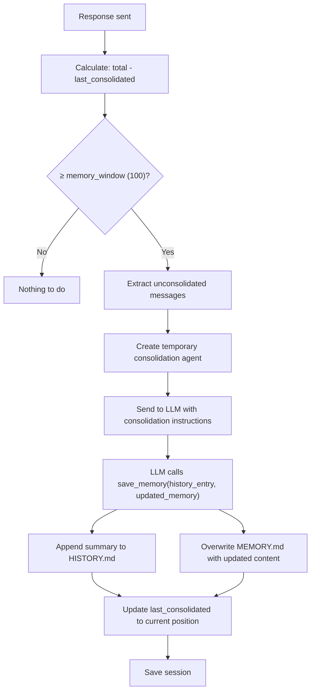

The process in detail:

1. `_check_consolidation()` checks: `total_messages - last_consolidated >= memory_window`
2. If yes, extracts unconsolidated messages from the session
3. Creates a temporary "consolidation agent" with access **only** to the `save_memory` tool
4. Sends the messages to the LLM with instructions:

```
"You are a memory consolidation agent. Analyze the conversation below and:
1. Write a timestamped summary for HISTORY.md
2. Update the long-term MEMORY.md with important facts, preferences,
   and context about the user.

Current MEMORY.md content:
{current content or '(empty)'}

Use the save_memory tool to persist both."
```

5. The LLM analyzes and calls `save_memory` (loop of up to **5 iterations** to ensure the LLM has a chance to complete)
6. `save_memory` writes:
   - `history_entry` → **appended** to the end of `HISTORY.md`
   - `updated_memory` → **overwrites** the entire `MEMORY.md`
7. The `last_consolidated` cursor is updated
8. If consolidation fails, the error is logged but **does not interrupt** the main flow

### save_memory Tool (Manual Use)

The agent can also call `save_memory` during a normal conversation if the user asks to remember something important. In this case, the information is saved directly to the memory files.

---

## 17. Sessions

A **session** represents a single continuous conversation between a user and the agent. It stores the full message history — user messages, assistant responses, tool calls, and tool results — so the LLM has context from previous turns. Without sessions, every message would be processed in isolation with no memory of what was said before.

The `SessionManager` (`openbotx/session/manager.py`) manages the entire lifecycle: creation, loading, saving, listing, and deletion.

### What a Session Contains

The `Session` dataclass holds:

| Field | Type | Description |
|---|---|---|
| `key` | `str` | Unique identifier (e.g., `web:direct`, `telegram:123456`) |
| `messages` | `list[dict]` | Full conversation history — each entry has `role`, `content`, `timestamp`, and optionally `tool_calls`, `tool_call_id`, `name` |
| `created_at` | `datetime` | When the session was first created |
| `updated_at` | `datetime` | Last modification timestamp |
| `metadata` | `dict` | Arbitrary metadata dictionary |
| `last_consolidated` | `int` | Cursor position for memory consolidation (see section 16) |

### Session Key

Each session is identified by a **key** derived from the incoming message. The default formula is:

```
session_key = "{channel}:{chat_id}"
```

Examples:
- **Web (default):** `web:direct` — when the frontend sends a message with `session_id="direct"`
- **Web (custom):** `web:project-alpha` — when the frontend sends `session_id="project-alpha"`
- **Telegram:** `telegram:123456789` — the Telegram chat ID
- **Cron:** `web:direct` — cron jobs use `channel="web"` and `chat_id="direct"` by default

This key determines which JSONL file is loaded and which conversation history the agent sees.

### session_key_override

The `InboundMessage` dataclass has a `session_key_override` field (default: `None`). When set, it **completely replaces** the default `channel:chat_id` key:

```python
@property
def session_key(self) -> str:
    return self.session_key_override or f"{self.channel}:{self.chat_id}"
```

This is an extension point for custom integrations. It is **not used** by the built-in web or Telegram channels — they rely on the default key. However, it enables scenarios such as:

- **Custom API consumers** that want explicit control over which session a message belongs to (e.g., sending `session_key_override="project:backend"` to group messages by project instead of by channel)
- **Shared sessions** — multiple different users or channels routing messages into the same session by specifying the same override key
- **Topic-based sessions** — a single user splitting conversations into different sessions based on subject rather than the default one-session-per-chat model
- **External orchestrators** that inject messages via the bus and need to target a specific existing session by its exact key

Example — an external system publishing a message directly to the bus:

```python
msg = InboundMessage(
    channel="api",
    sender_id="external-system",
    chat_id="irrelevant",
    content="Generate the weekly report",
    session_key_override="reports:weekly",
)
await bus.publish_inbound(msg)
```

In this case, the session key will be `reports:weekly` regardless of the `channel` and `chat_id` values.

### Session Lifecycle

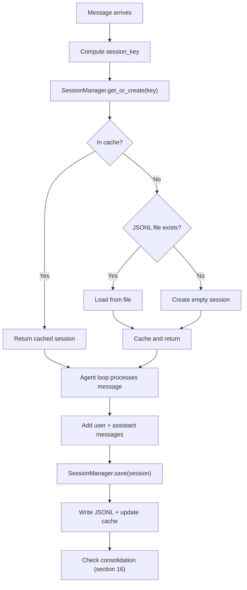

Step by step:

1. **Key computation** — `InboundMessage.session_key` returns `session_key_override` if set, otherwise `{channel}:{chat_id}`
2. **Load or create** — `get_or_create(key)` checks the in-memory cache first; if not found, attempts to load from the JSONL file; if the file doesn't exist, creates a new empty `Session`
3. **Agent loop** — The agent uses `session.get_history()` to build the conversation context for the LLM
4. **Save** — After the agent loop completes, the user message and assistant response are appended to the session, and it's written back to disk
5. **Consolidation check** — If unconsolidated messages exceed `memory_window`, memory consolidation triggers (see section 16)

### Storage Format

Sessions are persisted as **JSONL** (JSON Lines) files in the `sessions/` folder of the workspace:

```
workspace/
  sessions/
    web_direct.jsonl
    telegram_123456789.jsonl
    reports_weekly.jsonl
```

The filename is derived from the session key: `:` is replaced with `_` and invalid filesystem characters are removed via `re.sub(r"[^\w\-.]", "_", key)`.

Each file has a **metadata line** as the first entry, followed by one line per message:

```jsonl
{"_type": "metadata", "key": "web:direct", "created_at": "2025-01-15T10:00:00", "updated_at": "2025-01-15T14:30:05", "metadata": {}, "last_consolidated": 0}
{"role": "user", "content": "Hello", "timestamp": "2025-01-15T14:30:00"}
{"role": "assistant", "content": "Hello! How can I help?", "timestamp": "2025-01-15T14:30:05"}
{"role": "user", "content": "Read the README file", "timestamp": "2025-01-15T14:31:00"}
{"role": "assistant", "content": "", "tool_calls": [{"id": "tc_1", "type": "function", "function": {"name": "read_file", "arguments": "{\"path\": \"README.md\"}"}}], "timestamp": "2025-01-15T14:31:02"}
{"role": "tool", "tool_call_id": "tc_1", "name": "read_file", "content": "# My Project\n...", "timestamp": "2025-01-15T14:31:03"}
{"role": "assistant", "content": "The README contains...", "timestamp": "2025-01-15T14:31:05"}
```

On save, the entire file is **rewritten** — metadata line first, then all messages sequentially. This ensures file consistency.

### In-Memory Cache

The `SessionManager` maintains an in-memory cache (`dict[str, Session]`):

1. `get_or_create(key)` checks the cache first — O(1) lookup
2. If not cached, loads from the JSONL file on disk
3. If the file doesn't exist, creates a new empty session
4. After every `save()`, the cache is updated with the latest state
5. `delete()` removes both the file and the cache entry

This means that during normal operation, sessions are only loaded from disk **once** — all subsequent access is from memory.

### History Retrieval

The `get_history(max_messages=500)` method returns the last **500 messages** from the session in the format the LLM API expects. This caps context size to avoid exceeding token limits. For each message, the following fields are included:

- `role` — `"user"`, `"assistant"`, or `"tool"`
- `content` — The message text
- `tool_calls` — Present on assistant messages that invoke tools
- `tool_call_id` — Present on tool result messages
- `name` — Tool name on tool result messages

### Clearing

The `/new` command (available via web chat or Telegram) clears the session:
- Removes **all messages** from the list
- Resets `last_consolidated` to **0**
- Saves the empty session to disk

This gives the user a fresh conversation while preserving long-term memory (which lives in `MEMORY.md`, not in the session).

### REST API Operations

| Method | Endpoint | Description |
|---|---|---|
| `GET` | `/api/chat/sessions` | List all sessions, sorted by last update (newest first) |
| `GET` | `/api/chat/sessions/{id}` | Return the complete history for session `web:{id}` |
| `DELETE` | `/api/chat/sessions/{id}` | Delete session `web:{id}` (file + cache) |

Note: the REST API prepends `web:` to the session ID automatically — so `GET /api/chat/sessions/direct` loads the session with key `web:direct`.

---

## 18. Task Management

The task system works as a **Kanban board** that shows what the agent is doing in real time.

### Task States

| State | Meaning |
|---|---|
| **TODO** | Task created, awaiting start |
| **DOING** | Task in progress |
| **DONE** | Task completed successfully |
| **ERROR** | Task failed with an error |

### Flow

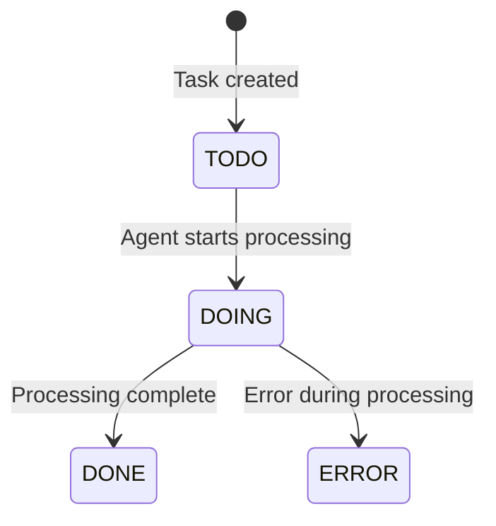

1. When the user sends a message, a task is created (state **TODO**)
2. Immediately changes to **DOING** when the agent starts processing
3. Upon completion, changes to **DONE** (with the first 200 characters of the result) or **ERROR** (with error message)

### Parent-Child Hierarchy

When a subagent is created via `spawn`, it gets its own task with:
- `agent_type: "subagent"` (instead of `"agent"`)
- `parent_task_id`: pointing to the main agent's task

The parent task maintains a `subagent_ids` list with the IDs of all created subtasks. This allows visualizing the hierarchy in the Kanban board.

### Identifiers

Task IDs are the first **8 characters** of a UUID4, for example: `"a1b2c3d4"`.

### Persistence

Tasks are saved in `tasks.jsonl` in the workspace. Each task is a JSON line, rewritten on every update.

### Real-time Broadcasting

Every state change is broadcast via WebSocket:
- **`task:created`** — when a task is created (payload: complete task as JSON)
- **`task:updated`** — when the state changes (payload: updated task as JSON)

The frontend receives these events and updates the Kanban board instantly.

---

## 19. Heartbeat and WebSocket

WebSocket is the primary real-time communication channel between the browser and the server.

### WebSocketManager

The `WebSocketManager` (`openbotx/server/websocket.py`) maintains a set of active connections:

```python
class WebSocketManager:
    def __init__(self):
        self._connections: set[WebSocket] = set()
```

### Broadcast Events

| Event | Description | When Sent |
|---|---|---|
| `chat:message` | Agent response | When the agent finalizes a response |
| `chat:thinking` | LLM reasoning | During the Agent Loop, if the LLM sends reasoning |
| `chat:tool_use` | Tool name (human-readable) | When a tool is executed |
| `task:created` | New task | When a task is created |
| `task:updated` | Task updated | When a task's state changes |

### Automatic Dead Connection Cleanup

When the server tries to send a message and fails (broken connection), the connection is automatically removed:

```python
async def broadcast(self, event_type, data):
    dead: set[WebSocket] = set()
    for ws in self._connections:
        try:
            await ws.send_text(msg)
        except Exception:
            dead.add(ws)
    self._connections -= dead  # remove dead connections
```

### Heartbeat

The frontend periodically sends "pings" over the WebSocket to ensure the connection is not closed due to inactivity. This is important because:

1. Proxies and load balancers may close idle connections
2. The browser may drop the connection if there's no activity
3. The server needs to detect disconnected clients

---

## 20. Scheduler (Cron)

The scheduler (`openbotx/cron/service.py`) allows programming tasks to be executed in the future or on a recurring basis.

### How It Works

The CronService runs in the background with a **tick every 5 seconds**. On each tick, it checks if any job needs to be executed:

```python
TICK_INTERVAL = 5.0  # seconds

async def run(self):
    while not self._stop_event.is_set():
        await asyncio.sleep(TICK_INTERVAL)
        await self._tick()
```

### Schedule Types

| Type | Description | Example | Next Run Calculation |
|---|---|---|---|
| `every` | Fixed interval | Every 3600s (1 hour) | `now + every_ms` |
| `cron` | Cron expression | `0 9 * * *` (daily at 9am) | Via `croniter` (supports timezone) |
| `at` | Specific date/time | `2025-01-20T10:00:00` | Fixed timestamp (one-time) |

### What Happens When a Job Executes

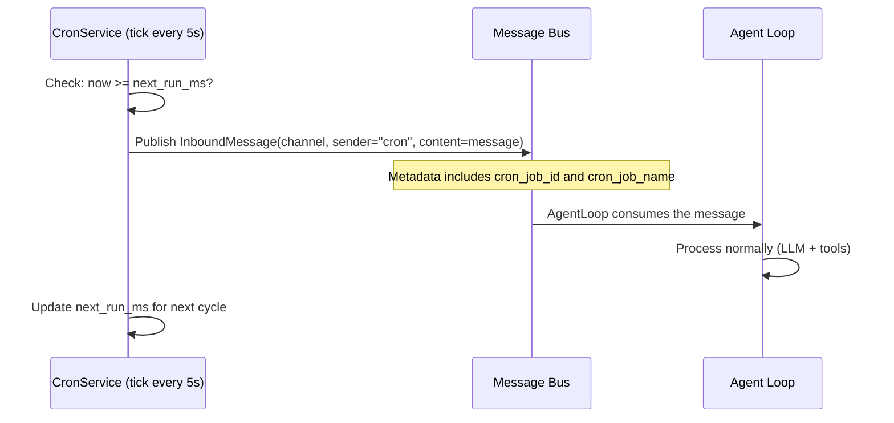

The cron message enters the bus like any other message — the AgentLoop doesn't know (and doesn't need to know) it came from a scheduled job.

### One-time Jobs

Jobs of type `at` have the flag `delete_after_run=True`. After execution, they are automatically removed from the job list.

### Persistence

Jobs are saved in `cron_jobs.json` in the workspace (indented JSON format). They survive server restarts.

### Job Creation

Jobs can be created in two ways:

1. **By the agent**: Using the `cron` tool (the LLM decides to create a schedule). Supports `add`, `list`, and `remove` actions. When adding, the channel and chat_id from the current conversation are automatically associated with the job
2. **Via REST API**: `POST /api/scheduler/jobs` with a JSON body containing `name`, `message`, and one of the scheduling fields (`cron_expr`, `every_seconds`, or `at`)

### Origin Tracking and Response Routing

Each cron job stores the **channel** and **chat_id** of the conversation where it was created. This determines where the agent's response will appear when the job fires.

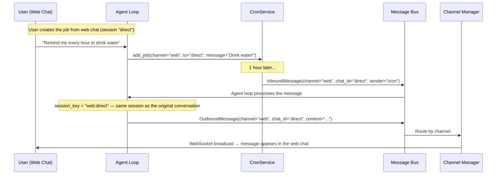

The key detail: when the `cron` tool creates a job, it saves the current `channel` and `chat_id` from `set_context()` (set by the agent loop before each message — see section 7.3). When the job fires, `_build_cron_callback()` uses these saved values to construct the `InboundMessage`:

```python
InboundMessage(
    channel=job.payload.channel or "web",   # origin channel
    sender_id="cron",
    chat_id=job.payload.to or "direct",      # origin chat_id
    content=job.payload.message,
)
```

This message enters the bus like any user message. The agent loop computes `session_key = "web:direct"`, loads the **same session history** from that conversation, processes it through the LLM, and publishes an `OutboundMessage` with the same `channel` and `chat_id`. The ChannelManager then routes it to the correct destination:

| Job created from | `channel` | `chat_id` | Response appears in |
|---|---|---|---|
| Web chat (default session) | `web` | `direct` | Browser via WebSocket |
| Web chat (custom session) | `web` | `project-alpha` | Browser via WebSocket (same session) |
| Telegram private chat | `telegram` | `123456789` | Telegram chat via API |
| Telegram group | `telegram` | `-100987654` | Telegram group via API |

The agent processes cron messages with the full session context, so it can reference previous conversations. For example, if the user discussed a project earlier in the same session, the agent's cron response can reference that context.

---

## 21. Output Routing

The `ChannelManager` (`openbotx/channels/manager.py`) is responsible for taking the agent's responses and delivering them to the correct recipient.

### How It Works

The ChannelManager runs a background task that consumes the bus outbound queue:

```python
async def _dispatch_outbound(self):
    while True:
        msg = await self.bus.consume_outbound()
        await self._route_message(msg)
```

### Message Filters

Before routing, two filters are applied:

| Metadata | Setting | Default | Effect |
|---|---|---|---|
| `progress: true` | `channels.send_progress` | `true` | Progress (intermediate) messages |
| `tool_hint: true` | `channels.send_tool_hints` | `false` | Hints about tools in use |

If the filter is disabled, the message is silently discarded.

### Routing

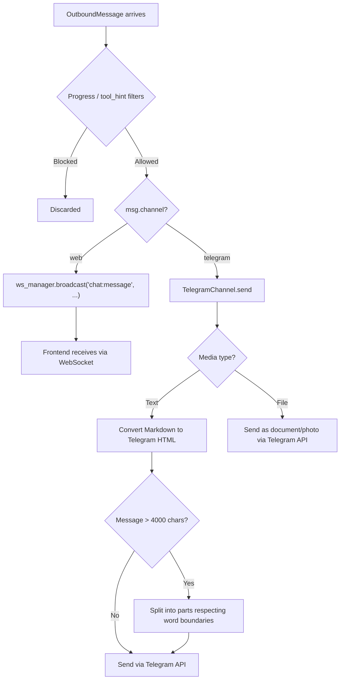

### Telegram: Sending Details

The `TelegramChannel` has special handling for Telegram:

- **Markdown → HTML conversion**: Telegram uses an HTML subset. The system converts `**bold**`, `` `code` ``, code blocks, etc., to the equivalent Telegram HTML tags
- **Long message splitting**: Messages larger than **4,000 characters** are split into multiple parts, respecting word boundaries to avoid cutting mid-sentence
- **Typing indicator**: During processing, the bot sends "typing..." every **4 seconds** so the user knows it's working
- **Format fallback**: If HTML sending fails, retries as plain text

---

## 22. Media Pipeline

Media files (images, audio, documents) are stored with **relative paths only**. Each consumer resolves the file in the format it needs: base64 data URI for the LLM, raw bytes for Telegram, HTTP URL for the web interface.

### Design Principle

The system never stores absolute URLs or encoded data in the message. Instead, it stores a **relative path** (e.g., `public/media/abc123.jpg`) and resolves on demand via the storage provider. This ensures compatibility across all consumers — cloud LLMs can't access `localhost` URLs, but they can process base64 data URIs.

### The `public/` Folder

All publicly-accessible files live under the `public/` directory at the project root:

```
project/
  public/
    media/
      abc123.jpg
      photo_xyz.png
    ...
  config.yml
  .env
```

The web server exposes `GET /public/{path}` to serve any file under this directory. This route works regardless of any configuration — the server always binds to the local `host:port` and serves files directly.

The `public_url` config field (`server.public_url` in `config.yml`) is **only** used when the system needs to generate absolute URLs for external access (e.g., `storage.get_url()` for sharing links). When empty (default), it falls back to `http://localhost:{port}`. On a VPS or production deployment, set it to the public domain (e.g., `https://my-domain.com`) so generated URLs point to the correct address.

### Storage Providers

The `StorageProvider` interface (`openbotx/storage/base.py`) defines the contract:

```python
class StorageProvider(ABC):
    async def read(path) -> bytes            # Raw bytes
    async def write(path, data) -> None
    async def delete(path) -> None
    async def list(prefix) -> list[str]
    async def exists(path) -> bool
    def get_url(path) -> str                 # Public HTTP URL
    def get_data_uri(path) -> str            # data:mime;base64,... for LLMs
```

Two implementations:

| Provider | Config `storage.type` | `get_url()` | `get_data_uri()` |
|---|---|---|---|
| `LocalStorage` | `"local"` (default) | `{public_url}/{path}` | Read file, detect MIME, encode base64 |
| `S3Storage` | `"s3"` | `https://{bucket}.s3.{region}.amazonaws.com/{path}` | Download from S3, encode base64 |

For `LocalStorage`, the `base_path` points to the **project root** directory. All paths are relative within it (e.g., `public/media/abc123.jpg` resolves to `project/public/media/abc123.jpg`). This allows the storage to handle any project file, not just public assets.

### Data Flow

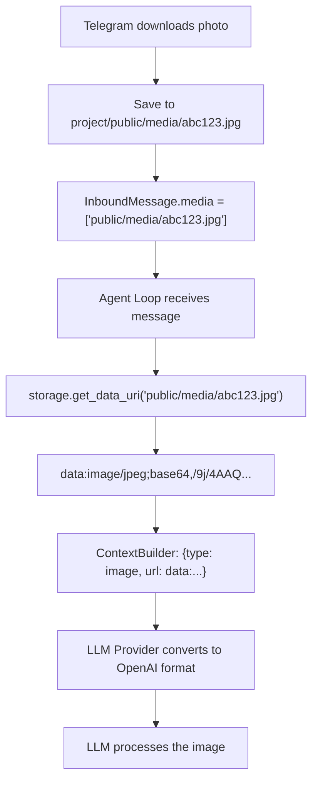

Each consumer resolves the path differently:

| Consumer | Method | Result |
|---|---|---|
| **LLM (Agent Loop)** | `storage.get_data_uri(path)` | `data:image/jpeg;base64,...` — works with all cloud providers |
| **Telegram outbound** | `open(project_dir / path, "rb")` | Raw bytes sent via Telegram API |
| **Web interface** | `GET /public/{path}` | HTTP file response served by FastAPI |
| **Public URL generation** | `storage.get_url(path)` | Absolute URL for sharing or embedding |

### Internal vs API Format

OpenBotX uses a clean internal format for image content blocks:

```json
{"type": "image", "url": "data:image/jpeg;base64,/9j/4AAQ..."}
```

Before sending to the LLM API, the provider automatically converts it to the OpenAI-compatible format:

```json
{"type": "image_url", "image_url": {"url": "data:image/jpeg;base64,/9j/4AAQ..."}}
```

This conversion happens transparently in `LLMProvider._convert_image_blocks()`, keeping the internal API clean while maintaining compatibility with all LLM providers via LiteLLM.

### Configuration

In `config.yml`:

```yaml
server:
  host: 0.0.0.0
  port: 8000
  public_url: ""  # optional — only for generating public URLs and opening browser

storage:
  type: local  # or "s3"
  # S3-specific fields:
  s3_bucket: my-bucket
  s3_region: us-east-1
  s3_access_key: ${AWS_ACCESS_KEY}
  s3_secret_key: ${AWS_SECRET_KEY}
```

### `public_url` Behavior

The web server always binds to `host:port` and serves everything locally — the `public_url` field does **not** change how the server runs. It is used in two places:

1. **`storage.get_url(path)`** — generates absolute URLs for external access (e.g., `https://my-domain.com/public/media/abc123.jpg`). When empty, uses `http://localhost:{port}`
2. **Browser auto-open** — when `openbotx start` runs, if `public_url` is set, the browser opens at that URL instead of `localhost`

Typical scenarios:

| Environment | `public_url` | Browser opens at | `get_url()` returns |
|---|---|---|---|
| Local development | `""` (empty) | `http://localhost:8000/app/` | `http://localhost:8000/public/media/...` |
| VPS with domain | `"https://bot.example.com"` | `https://bot.example.com/app/` | `https://bot.example.com/public/media/...` |
| VPS with IP | `"http://203.0.113.10:8000"` | `http://203.0.113.10:8000/app/` | `http://203.0.113.10:8000/public/media/...` |

---

## 23. Server Shutdown

When the server is stopped (Ctrl+C or shutdown signal), the lifespan executes the shutdown sequence:

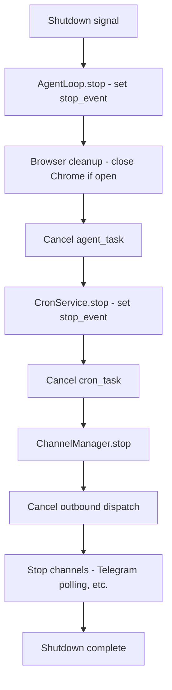

`AgentLoop.stop()`, in addition to setting the `_stop_event`, also calls `browser_tool.cleanup()` if the browser tool is registered. This terminates the entire Chrome process, closing all tabs. Individual subagent tabs are already cleaned up via `close_tab()` in their `finally` blocks (see section 15).

---

## 24. Complete Cycle

Summary of the complete message flow, from start to finish:

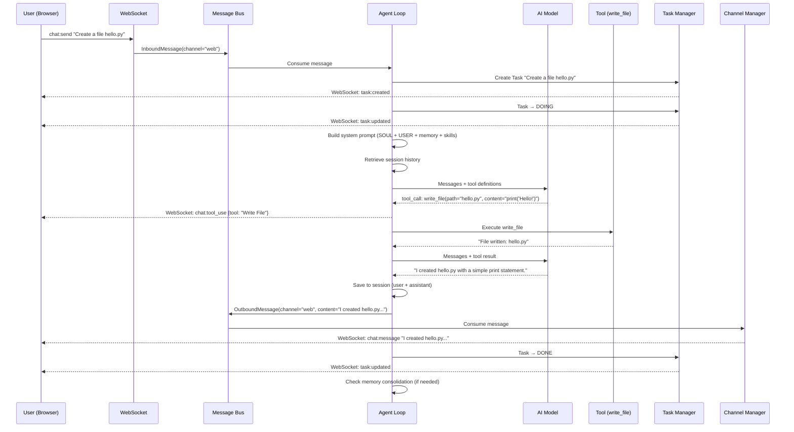

This cycle happens for **every message**, whether from web, Telegram, or cron. The only difference is the input and output channel — the internal processing is always the same.
